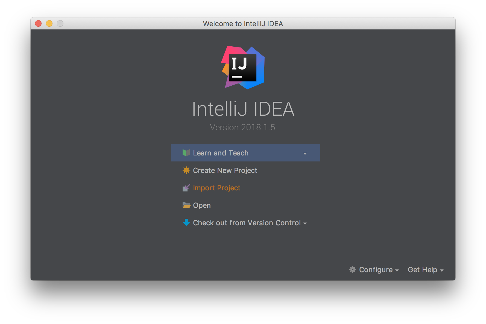
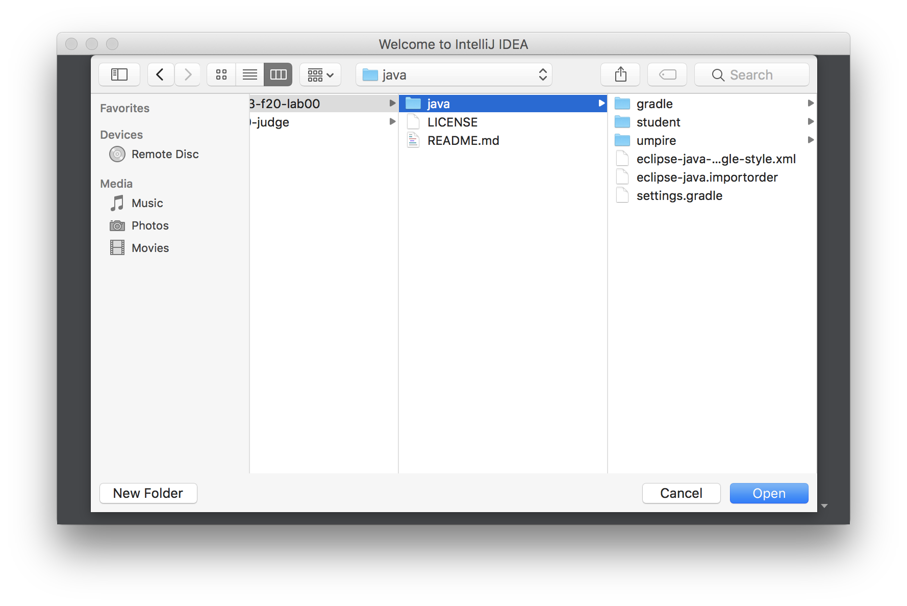

It's recommended that you use intelliJ (or Eclipse) to import this starter code, and implement your solutions.
You'll also need to install [`Gradle`](https://gradle.org/) for managing a java project.

Note that this starter code has been tested with Java 1.8 and Gradle 4.10.3, although future versions of Java/Gradle should also work.

1. First, download [intelliJ](https://www.jetbrains.com/idea/download/) or [Eclipse](https://www.eclipse.org/downloads/).This instruction only cover intelliJ.
2. Check out this repository to your local machine.
3. From intelliJ, choose `Import Project`

4. Choose to import the `java` directory as a whole (this will make intelliJ recognize the gradle project).

5. 
